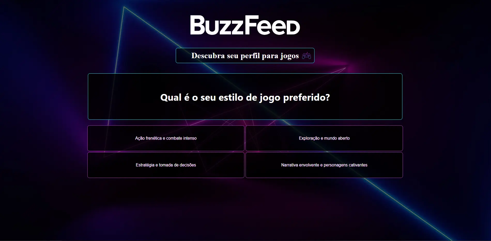

<h1 align="center"> BuzzFeed clone </h1>

Projeto base desenvolvido durante o bootcamp da DIO potência Tech Angular Developer - Powered by iFood .  

  <a href="#-tecnologias">Tecnologias</a>&nbsp;&nbsp;&nbsp;|&nbsp;&nbsp;&nbsp;
  <a href="#-projeto">Projeto</a>&nbsp;&nbsp;&nbsp;

 

  

## 🚀 Tecnologias

Esse projeto foi desenvolvido com as seguintes tecnologias:

- HTML e CSS
- Angular
- TypeScript
- Git e Github

## 💻 Projeto

O Habits é um app para ajudar a rastrear os hábitos.

- [Acesse o projeto ](https://gabtech1.github.io/Buzzfeed-quizz-clone/)
---

Divirta-se :wave: